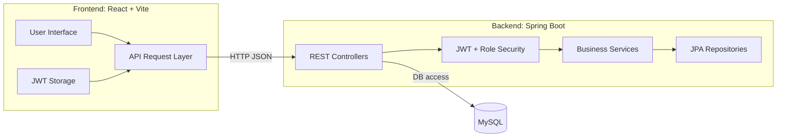
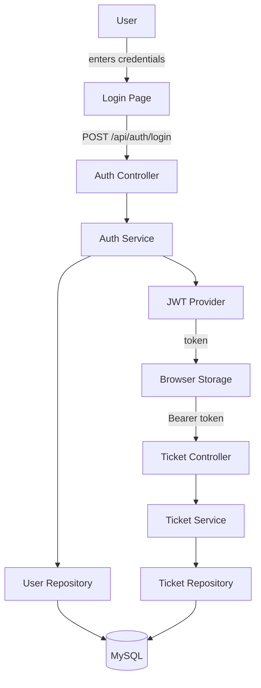
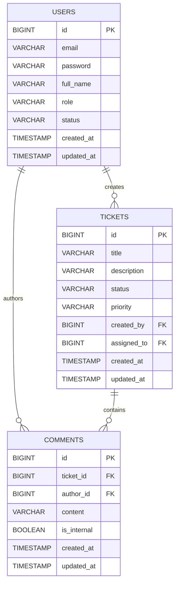

# Ticketing System Capstone Presentation

## Slide 1: Title Slide

**Hi everyone, I’m presenting the Ticketing System full-stack project.**

- **Project:** Ticketing System
- **Frontend:** React + Vite
- **Backend:** Spring Boot + Gradle
- **Database:** MySQL
- **Goal:** manage client support tickets, agent workflows, and admin analytics

---

## Slide 2: Project Summary

**Ticketing System is a role-aware support ticket platform that includes:**

- User registration and authentication
- Ticket creation, assignment, status updates, and comments
- Role-based dashboards for clients, support agents, and admins
- Admin analytics and user management
- Secure JWT token authorization

---

## Slide 3: Frontend and Backend Separation

**Frontend responsibilities:**

- Render UI pages and dashboards
- Manage session state and tokens
- Call backend services with Axios
- Protect routes based on user status and role

**Backend responsibilities:**

- Expose REST endpoints
- Validate JWT tokens
- Enforce role permissions
- Persist data via JPA
- Return standardized JSON responses

---

## Slide 4: System Architecture Diagram



---

## Slide 5: User Flowchart

**This is how a user login and ticket workflow works:**



---

## Slide 5.1: Entity Relationship Diagram



---

## Slide 6: Role-Based Pages

| Role | Main Page | Key Actions |
|---|---|---|
| CLIENT | Dashboard + My Tickets | Create ticket, view own tickets, comment |
| SUPPORT_AGENT | Agent dashboard + Assigned tickets | Claim/resolve tickets, add comments, update status |
| ADMIN | Admin dashboard + Analytics | Manage users, view all tickets, stats |

---

## Slide 7: Key Pages and Routes

- `/login` — login screen
- `/register` — register account
- `/dashboard` — role-specific landing page
- `/tickets` — ticket list
- `/tickets/create` — new ticket form
- `/tickets/:id` — ticket detail and comments
- `/analytics` — admin analytics page
- `/users` — admin user management

---

## Slide 8: Backend API Map

```mermaid
flowchart LR
    A[/api/auth/*] --> B[AuthController]
    C[/api/tickets/*] --> D[TicketController]
    E[/api/tickets/*/comments] --> F[CommentController]

    B -->|auth| UserService
    D -->|ticket logic| TicketService
    F -->|comments| CommentService
```

---

## Slide 9: Frontend Architecture

**Important frontend parts:**

- `src/App.jsx` — routes and protected route logic
- `src/context/AuthProvider.jsx` — user session state
- `src/services/api.js` — Axios with auth token
- `src/services/ticketService.js` — ticket API calls
- `src/services/authService.js` — login/register
- `src/components/Dashboard/*` — role dashboards
- `src/pages/AnalyticsPage.jsx` — analytics and PDF export

---

## Slide 10: Backend Architecture

**Important backend parts:**

- `src/main/java/org/example/ticketingsystem/controller` — HTTP controllers
- `src/main/java/org/example/ticketingsystem/service` — business logic
- `src/main/java/org/example/ticketingsystem/model` — data entities
- `src/main/java/org/example/ticketingsystem/repository` — database repositories
- `src/main/resources/application.properties` — production DB config
- `src/test/resources/application-test.properties` — H2 for tests

---

## Slide 11: Analytics and Reporting

The admin analytics page calculates:

- total ticket count
- open/in-progress/resolved ticket ratios
- average resolution time
- first response time
- agent utilization
- ticket satisfaction and resolution rate

Visuals include charts, summary cards, and export-to-PDF support.

---

## Slide 12: Run Commands

**Backend**

```bash
cd ticketing-system-backend
./gradlew clean bootRun
```

**Frontend**

```bash
cd ticketing-system-frontend
npm install
npm run dev
```

**Tests**

```bash
cd ticketing-system-backend
./gradlew test
```

---

## Slide 13: What Makes This Project Strong

- Clean frontend/backend separation
- Role-based access control across UI and API
- Secure JWT auth flow
- Ticket workflow with assignment, status, and comments
- Admin analytics and user management
- CI-ready build and test configuration

---

## Slide 14: Future Enhancements

- Add refresh-token support
- Improve ticket filtering and search
- Add real-time notifications using WebSockets
- Add audit log for admin actions
- Containerize with Docker for deployment
- Add more frontend tests and end-to-end scenarios

---

## Slide 15: Closing Statement

**Ticketing System shows a complete end-to-end full-stack solution:**

- React UI for ticket management
- Spring Boot REST backend for security and logic
- Database persistence with JPA
- Admin reporting and role-based control

**Summary sentence:** React renders the experience, Spring secures the flow, and SQL stores the data.
