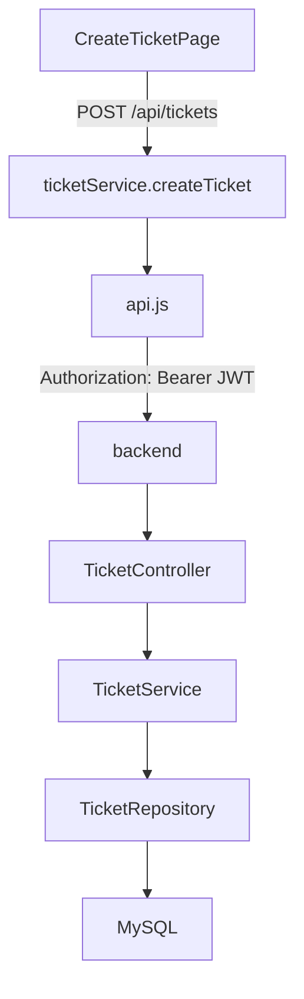
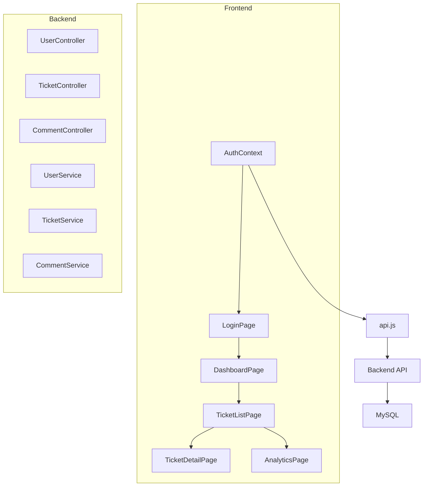

# Ticketing System User Guide (For Dummies)

## 1) Big Picture

This project is a full-stack ticketing system built in two parts:

- **Frontend:** React + Vite application under `ticketing-system-frontend`
- **Backend:** Spring Boot application under `ticketing-system-backend`
- **Database:** MySQL in production, H2 in tests

The frontend sends HTTP requests to the backend. The backend checks authorization, runs business logic, and stores data in the DB.

---

## 2) What the Frontend Does

The frontend is the user interface.
It is responsible for:

- Showing login, registration, dashboard, ticket list, ticket details, analytics, and user pages
- Sending requests to backend APIs through `axios`
- Storing the JWT token and current user in local storage
- Protecting routes using user login state and roles
- Rendering role-specific dashboards for CLIENT, SUPPORT_AGENT, and ADMIN

### Main frontend folders

- `ticketing-system-frontend/src/pages` — page screens
- `ticketing-system-frontend/src/components` — reusable components, dashboard widgets, ticket cards
- `ticketing-system-frontend/src/services` — API calls
- `ticketing-system-frontend/src/context` — auth and toast context
- `ticketing-system-frontend/src/utils` — helpers like analytics calculations

---

## 3) What the Backend Does

The backend is the application brain.
It is responsible for:

- Exposing REST API endpoints for auth, tickets, users, and comments
- Verifying JWT tokens and checking roles
- Managing data with Spring Data JPA and Hibernate
- Returning JSON responses wrapped in `ApiResponse`
- Running tests with an H2 database profile

### Main backend folders

- `ticketing-system-backend/src/main/java/org/example/ticketingsystem/controller` — HTTP endpoints
- `ticketing-system-backend/src/main/java/org/example/ticketingsystem/service` — business logic
- `ticketing-system-backend/src/main/java/org/example/ticketingsystem/repository` — database access
- `ticketing-system-backend/src/main/java/org/example/ticketingsystem/model` — entity definitions
- `ticketing-system-backend/src/main/java/org/example/ticketingsystem/dto` — request/response payloads

---

## 4) Core User Roles

This app uses roles to decide what users can do.

- **CLIENT**: create tickets, view own tickets, update profile
- **SUPPORT_AGENT**: view assigned tickets, update ticket status, comment on tickets
- **ADMIN**: view all tickets, manage users, restore/deactivate users, view analytics

### Role-based route protection

- `/dashboard` shows a different dashboard for each role
- `/tickets` and `/tickets/assigned` are protected routes
- `/analytics` is ADMIN only
- `/users` is a shared page for user management

---

## 5) Visual Architecture

```text
┌──────────────────────────────────────────────────────────────┐
│ Frontend Client (React implemented / Angular possible)       │
│ - Login/Register/Profile                                     │
│ - Dashboard / Ticket List / Analytics                        │
│ - Admin Dashboard / Users / Tickets                          │
└───────────────────────────┬──────────────────────────────────┘
                            │ HTTPS + JWT (Bearer Token)
┌───────────────────────────▼──────────────────────────────────┐
│ Spring Boot REST API (Gradle)                                │
│ Controllers: AuthController, TicketController, CommentController, AdminController │
├──────────────────────────────────────────────────────────┤
│ Services: AuthService, TicketService, CommentService, AdminService             │
├──────────────────────────────────────────────────────────┤
│ Security: JwtFilter, JwtUtil, SecurityConfig                  │
├──────────────────────────────────────────────────────────┤
│ Repositories: UserRepository, TicketRepository, CommentRepository            │
├──────────────────────────────────────────────────────────┤
│ Entities: User, Ticket, Comment                                │
└───────────────────────────┬──────────────────────────────────┘
                            │ JPA / Hibernate
┌───────────────────────────▼──────────────────────────────────┐
│ MySQL Database                                               │
└──────────────────────────────────────────────────────────────┘
```

### What happens when the user logs in

```mermaid
flowchart LR
    classDef frontend fill:#2563eb,stroke:#1d4ed8,color:#ffffff,stroke-width:2px;
    classDef backend fill:#0f766e,stroke:#115e59,color:#ffffff,stroke-width:2px;

    User[User] -->|enter credentials| LoginPage[Login Page]
    LoginPage -->|POST /api/auth/login| AuthController[UserController]
    AuthController --> AuthService[AuthService]
    AuthService --> UserRepo[UserRepository]
    UserRepo --> DB[(MySQL)]
    AuthService --> JwtProvider[JwtTokenProvider]
    JwtProvider -->|JWT token| Browser[Browser Storage]
    Browser -->|Bearer token| TicketController[TicketController]
    TicketController --> TicketService
    TicketService --> TicketRepo[TicketRepository]
    TicketRepo --> DB

    class LoginPage,AuthController,AuthService,UserRepo,TicketController,TicketService,TicketRepo backend;
    class User,Browser frontend;
```



---

## 5.1) Entity Relationship Diagram

```text
**Entity Relationship Snapshot:**

┌──────────┐          ┌────────────┐
│   User   │          │   Ticket   │
├──────────┤          ├────────────┤
│ id (PK)  │1----Many │ id (PK)    │
│ email    │          │ title      │
│ password │          │ description│
│ role     │          │ status     │
│ status   │          │ priority   │
│          │          │ created_by (FK)
│          │          │ assigned_to (FK)
│          │          │ createdAt  │
│          │          │ updatedAt  │
└──────────┘          └────────────┘
                            │
                            │1----Many
                            ▼
                     ┌──────────────┐
                     │   Comment    │
                     ├──────────────┤
                     │ id (PK)      │
                     │ ticket_id(FK)│
                     │ author_id(FK)│
                     │ content      │
                     │ is_internal  │
                     │ createdAt    │
                     │ updatedAt    │
                     └──────────────┘
```

---

## 6) Key Frontend Routes

| Route | What it does |
|---|---|
| `/login` | Login form |
| `/register` | New user signup |
| `/dashboard` | Role-specific dashboard |
| `/tickets` | Ticket list for current user or role |
| `/tickets/create` | Create a new ticket |
| `/tickets/:id` | Ticket detail page |
| `/analytics` | Admin analytics page |
| `/users` | User list and admin actions |

---

## 7) Key Backend API Endpoints

| Endpoint | Method | Who uses it |
|---|---|---|
| `/api/auth/login` | POST | login |
| `/api/auth/register` | POST | register |
| `/api/auth/me` | GET | get current user |
| `/api/auth/logout` | POST | logout |
| `/api/auth/users` | GET | admin user list |
| `/api/auth/users/{id}` | GET, PUT | user detail/update |
| `/api/auth/users/{id}/deactivate` | PUT | admin deactivation |
| `/api/auth/users/{id}/reactivate` | PUT | admin reactivation |
| `/api/tickets` | GET, POST | list/create tickets |
| `/api/tickets/{id}` | GET, PUT, DELETE | ticket detail/update/delete |
| `/api/tickets/{id}/status` | PATCH | update ticket status |
| `/api/tickets/{id}/assign` | PATCH | assign ticket |
| `/api/tickets/{id}/auto-assign` | PATCH | auto assign |
| `/api/tickets/{id}/resolve` | PATCH | resolve ticket |
| `/api/tickets/{id}/close` | PATCH | close ticket |
| `/api/tickets/user/mine` | GET | client ticket list |
| `/api/tickets/assigned/me` | GET | agent ticket list |
| `/api/tickets/stats` | GET | ticket statistics |
| `/api/tickets/{id}/comments` | GET, POST | comments on a ticket |
| `/api/tickets/comments/{id}` | PUT, DELETE | update/delete comment |

---

## 8) How the Frontend Calls the Backend

The frontend uses these service files:

- `src/services/api.js` — Axios instance with auth token interceptor
- `src/services/authService.js` — login/register/logout
- `src/services/ticketService.js` — ticket management
- `src/services/commentService.js` — comment CRUD

### Example: create ticket flow



---

## 9) How to Run the Project Locally

### Backend

```bash
cd ticketing-system-backend
./gradlew clean bootRun
```

### Frontend

```bash
cd ticketing-system-frontend
npm install
npm run dev
```

### Backend tests

```bash
cd ticketing-system-backend
./gradlew test
```

### CI note

- The backend test profile uses `application-test.properties`
- The frontend build requires Node 20+ because Vite 8 is used

---

## 10) Troubleshooting Common Issues

### If login fails

- Check that the backend is running and returning `200` from `/api/auth/login`
- Confirm the frontend is sending `Authorization: Bearer <token>` after login
- Make sure the user role is not `INACTIVE`

### If ticket pages show only 10 tickets

- The frontend uses pagination parameters and page size options
- The backend supports `page` and `size` for `/tickets/user/mine` and `/tickets/assigned/me`

### If frontend build fails on GitHub

- Ensure `.github/workflows/ci.yml` uses Node 20
- Make sure `package.json` engine is set to `>=20.19.0`

---

## 11) Quick Map of the Codebase



---

## 12) Best Mental Model

- Frontend = **UI and user actions**
- Backend = **security, rules, data validation**
- Database = **storage and persistence**

If you remember one sentence: **React asks, Spring decides, SQL remembers.**
